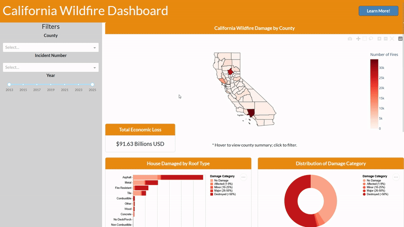

# California Wildfires Dashboard
***A one-stop shop for glearing insights from California Wildfires data***

[](https://dsci-532-2025-27-ca-wildfire-dashboard.onrender.com/)

## Welcome
Welcome to our California Wildfires Dashboard! This tool will give you insights in how wildfire has impacted California in the past decade (2013-2025).

## Motivation and Purpose
California is highly susceptible to wildfires due to its dry, hot climate. With global warming intensifying, wildfires are expected to become more frequent and severe. Understanding their historical impact is crucial. Our dashboard consolidates key wildfire data into a single, accessible platform, offering valuable insights for local residents, policymakers, and anyone interested. By providing a comprehensive overview, it supports informed decision-making and effective prevention strategies to aid in mitigation efforts. 

With the California Wildfires Dashboard you can:
- Explore the impact of wildfires across different counties in California
- Analyze financial loss trends over time due to wildfires
- Investigate how various building structures are affected by wildfires

## Data Attribution
This project uses data from the [CAL FIRE Damage Inspection (DINS) data](https://data.ca.gov/dataset/cal-fire-damage-inspection-dins-data) available from the California open data portal.


## Usage
**Access our Webapp [here](https://dsci-532-2025-27-ca-wildfire-dashboard.onrender.com/)**

### Dashboard in action
Have a look at the following demo:


## Installation and running the app locally
To run the dashboard locally, please follow these steps:
1) **Install Dependencies**
Clone the repository and install dependencies:
```bash
git clone https://github.com/UBC-MDS/DSCI-532_2025_27_CA_Wildfire-Dashboard.git
cd DSCI-532_2025_27_CA_Wildfire-Dashboard
conda env create --file environment.yaml
```
2) **Run the app**
You can run the dash app by running:
```bash
conda activate 532-27
python src/app.py
```
The dashboard will be accessible at **`http://127.0.0.1:8050/`** in your browser.  

---

## Reporting issues
If you encounter any issues with the dashboard or have feature requests, please feel free to [open an issue](https://github.com/UBC-MDS/DSCI-532_2025_27_CA_Wildfire-Dashboard/issues)—we’d love to hear your feedback!

## Contributing
We welcome meaningful contributions to the project, please follow the our [contribution guideline](https://github.com/UBC-MDS/DSCI-532_2025_27_CA_Wildfire-Dashboard/blob/main/CONTRIBUTING.md) for more information and instructions.


## License
### **Software**  
MIT License  

Copyright (c) 2025 **Gunisha Kaur, Thamer Aldawood, Elaine Chu, Forgive Agbesi**  

This project is licensed under the **MIT License**.

### **Non-Software Materials**  
All non-software materials in this repository are licensed under **Creative Commons Attribution 4.0 International (CC BY 4.0)**. You are free to:  
- **Share** – Copy and redistribute the material.  
- **Adapt** – Remix, transform, and build upon the material.  
- **Attribution Required** – Give credit and indicate changes made.  

See the full license details [here](LICENSE.md).  
