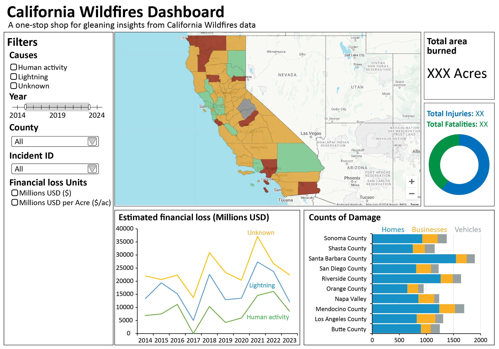

# Milestone 2 - Reflection

## Original sketch of dashboard

## **Implemented Features**
- Filters for Year, County, and Incident ID.
- Geospatial map reflecting degree of wildfire affect on each county.
- Donut chart showing ratio of different damage level.
- Time series chart showing economic loss over time.
- 2 Bar charts reflecting the category in relation to the structures.
- Summary card of total financial loss.

## **Features Not Implemented**
- Filter by cause of fire was not implemented due to data limitations.
- Option to display financial loss in Millions of USD or Millions of USD per Acre, also due to data limitations.
- Summary card for total area burned is replaced with summary card of total financial loss, also due to data limitations.

-----------------------------------------------------------
## **Deviations from Proposal**
The dataset initially proposed in our original proposal was found to be synthetic. Consequently, we sourced an alternative dataset from the California Fire Department directly. Due to differences in data structure and available features, some originally planned implementations were not feasible. We adjusted our dashboard accordingly to align with the newly acquired dataset. The deviations are as followed:
- Filter by cause of fire was not implemented because the dataset only has that information for 10% of the reported fire incidences
- Total burned acreage was no longer available, therefore the summary card for total area burned is replaced with summary card of total financial loss. Additionally, it was not possible to implement the option to display financial loss in Millions of USD or Millions of USD per Acre either.
- The number of fatalties and injuries were not available in the new dataset. Instead, we utilized the information on what the damage category was instead.
- We had additional information on roof types in the new dataset. Hence we added an additional bar chart to reflect how the houses with different roof types have different distribution of damage levels.
- The geospatial heatmap represents the total number of fires in each county rather than the financial loss. When hovering over a county, it displays the total fire count instead of the financial loss amount or the count of different damage categories.

-----------------------------------------------------------
## **What the dashboard currently does well**
- Gives a quick overview of the damage caused by California Wildfires.
- Lets you see and compare the damage caused by each incident, or compare how much damage each county has suffered.
- It clearly showcases which structure categories and roof types are most affected by wildfires.
-----------------------------------------------------------
## **Current Limitations & Future Improvements**

### **Limitations**
- Title of summary card does not always render correctly on dashboard.
- Filters are very slow to update on the rendered app (They work fine when run locally).

### **Future Enhancements**
- Selecting counties on the map serves as a filter for the other charts.
- Enable the legend in both the roof type bar chart and the donut chart as filtering features. Link the two charts so that selecting damage categories updates both charts to display only the selected categories.
- Adding some text to provide context and guide users through the charts for better coherence. 
- Aesthetic improvements. e.g., layout, colors, charts, etc.