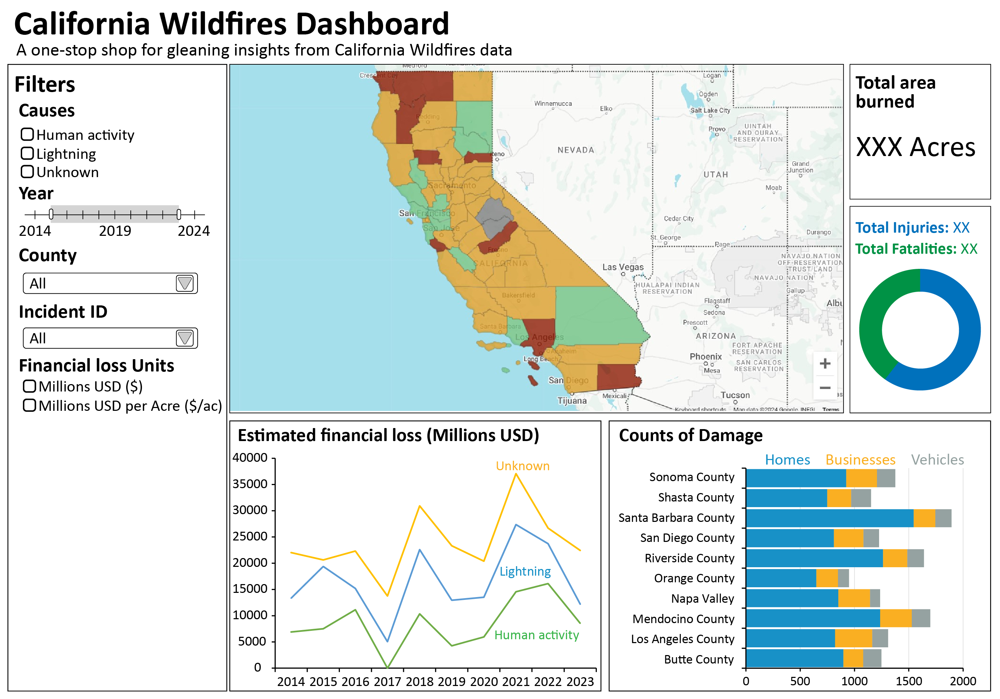

# Milestone 4 - Reflection

## Original sketch of dashboard

## **Implemented Features**

- Removed 0 on Y-axis everywhere for Line chart
- Introduced state and submit buttons for all three filters.
- Used incident name instead of incident ID for easy identification
- Removed Zoom on the buttom line charts
- Added cleadr filter button for all filters
- Create favicon and tab title
- Enhance user guidance and context through text.
- The performance of the dashboard was improved by:
  - Cache initial dashboard
  - optimizing our preprocessed data and only keeping pre-aggregating key values from our raw dataset
  - Save preprocessed data in more efficient format (other than CSV) (parquet / feather / pickle).
  - "Apply filters" button to avoid updating the entire dashboard with every single filter input.
  - Experimented with Dask implementation but found that it did not solve our issues so we chose to stick with pandas for ease of use
- The dashboard layout was improved with:  
  - Align cards at the button for better readability.
  - Align labels in filter with correct input fields.
  - Removed "Filter" on side bar for better aesthetics.
  - Fix issue where "Learn more" container sometimes take full width horizontally.
- All app files are properly organized.  
- **For Challenging Question**: We added numpy docstrings to all functions. We also added test cases for all functions in the SRC folder.

## **Features Not Implemented**

- Tooltip summary of hovering on map to include counts based on damage level was not included. Calculating the count was too complex and impacting the performance of the visualization. This was due to data inconsistencies and limitations in Plotly's customization.
- Unfortunately, caching will not work well in our app as most of our functions take a pandas dataframe as an argument which cannot be hashed and thus cannot be cached.
- heat map does not update anymore when we filter by selecting the counties, this is to improve the performance of the application.

-----------------------------------------------------------

## **Deviations from Proposal**

- The map no longer changes color when you filter for different counties. This is an attempt to lower the computation needed for the dashboard to deploy on render.

-----------------------------------------------------------

## **What the dashboard currently does well**

- Provides a clear visual summary of wildfire impact across California.  
- Supports multi-county comparisons through an interactive map, graphs, and filters.  
- Displays structure and roof type damage trends effectively.  
- Enhances user experience with tooltips, loading indicators, and a structured layout.  
- Allows users to compare wildfire damage by incident or by county.  
- Clearly highlights the most affected structure categories, roof types, and counties.  
- Visualizes economic loss trends, emphasizing financial damage over time.  
- Offers additional insights through the Learn More feature for deeper analysis.  
- Provides a clear and concise user guide for easy navigation.
- The performance of the dashboard was improved for faster loading and interactivity.
- Submit button for filters to avoid updating the entire dashboard with every single filter input.

-----------------------------------------------------------

## **Current Limitations & Future Improvements**

### **Limitations**

- Interactivity on the filters is working fine when ran locally, however it is not working on the deployed app on render despite all the efforts we have made to improve the performance of the dashboard. We have simplified the map creation proces, changed our map file to a smaller more optimized geojson file, preaggregate our data to make it signiciantly smaller and only keeping values needed for the charts, pickled our preprocessed dataframe, and tried process the dataframe with dask instead. With the steps we have taken, at least now the map is able to load on the web application, but the callbacks for interactivity is still timing out and not able to update the graphs properly.  
- The tooltip summary of hovering on the map to include counts based on damage level was not included. Calculating the count was too complex and impacting the performance of the visualization. This was due to data inconsistencies and limitations in Plotly's customization.

### **Future Enhancements**

- Refine visuals for better clarity and usability.  
- Improve optimization and interactivity for faster filter updates.
- Implement a more efficient method for calculating the count of damage levels on hover.
- Explore better tooltip implementations for accuracy.  

## **Challenging Question**

- We added numpy docstrings to all functions.
- We also added test cases for all functions in the SRC folder.

## **Better Support**

- More discussion on using large datasets and how to optimize the dashboard for better performance would have been really helpful for my team as we struggled with this issue.

## **Insights and feedbacks**

- Feedback from the previous milestones was very helpful in improving the dashboard.
- The weekly interaction with Joel gave us a better understanding of the project and how to improve the dashboard as well as technical support.
- The feedback from the peer review was also very helpful in improving the dashboard as it gave as insight into aspects of the dashboard that we were not considering.
- sharing the dashboard of others was very insightful as it gave us an idea of what we could do to improve our dashboard.
